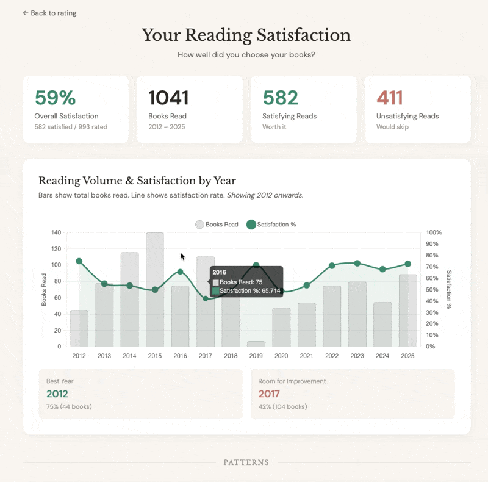

# Book Satisfaction Tracker

A simple tool to rate your reading choices and visualize satisfaction trends over time.


## How It Works

1. **Export** your reading data from StoryGraph
2. **Process** it with the included Python script (adds cover images)
3. **Rate** each book with a simple Yes/No
4. **Visualize** your satisfaction trends by year

## Quick Start

### Step 1: Get Your StoryGraph Data

1. Go to [StoryGraph](https://app.thestorygraph.com/manage-account)
2. Scroll to "Manage Your Data"
3. Click "Export StoryGraph Library"
4. Download the CSV when the email arrives

### Step 2: Process Your Data

```bash
# Move your export to the data folder, then process it
uv run process_csv.py data/your_storygraph_export.csv
```

This creates `data/books.json` with your books and cover images from Open Library.

**Options:**
- `--no-covers` — Skip fetching cover images (faster, but no visuals)

**Note:** Requires [uv](https://docs.astral.sh/uv/). The script uses Python 3.12+ with no external dependencies.

### Step 3: Run the App

Start the rating server (saves ratings to disk):

```bash
python3 server.py
```

Then open: http://localhost:8000

**To access from your phone** (through a VPN or remote network):

```bash
# Option 1: Same WiFi (no VPN)
# Your phone can access http://<your-ip>:8000
# Find IP with: ipconfig getifaddr en0

# Option 2: Through VPN or remote access (recommended)
# Use cloudflared for a public HTTPS URL:
cloudflared tunnel --url http://localhost:8000
# This gives you a URL like https://random-words.trycloudflare.com
```

**Note:** Ratings are saved to `data/ratings.json` on disk, so they persist across browsers and devices.

### Step 4: Rate Your Books

- Click **Yes** if you're satisfied you read the book
- Click **No** if you wish you'd skipped it
- Click **Skip** if you can't remember or can't decide

**Keyboard shortcuts:**
- `Y` or `→` = Yes
- `N` or `←` = No  
- `S` or `↓` = Skip

### Step 5: View Results

Once you've rated some books, click "View Charts" or go to `visualization.html`.



The visualization page shows:
- **Overall satisfaction rate** and key stats
- **Year-by-year trends** with volume overlay
- **Reading heatmap** showing satisfaction patterns across weeks
- **Cumulative satisfaction** tracking your pick-rate over time
- **Streak analysis** — your longest runs of hits and misses
- **Author loyalty** — which frequently-read authors satisfied you most

## Files

```
storygraph-rater/
├── index.html           # Rating interface (swipeable cards)
├── visualization.html   # Charts & analysis
├── process_csv.py       # CSV → JSON converter with cover fetching
├── server.py            # Local server that saves ratings to disk
└── data/
    ├── *.csv            # Your StoryGraph export (input)
    ├── books.json       # Processed book data (output)
    └── ratings.json     # Your ratings (auto-generated)
```

## Data Storage

- Ratings are saved to `data/ratings.json` **on disk** with every rating
- Also backed up to browser localStorage as fallback
- Works across browsers and devices when using the same server
- Export your data anytime with the "Export Data" button

## The Confidence Meter

The confidence meter shows how statistically reliable your results are:

| Rated % | Interpretation |
|---------|----------------|
| < 20%   | Low sample — results may vary significantly |
| 20-40%  | Building confidence — trends emerging |
| 40-60%  | Good sample — results fairly reliable |
| 60-80%  | Strong sample — high confidence in trends |
| > 80%   | Excellent coverage — very reliable results |

## Tips

- **Randomization** is intentional — it prevents temporal bias (remembering a "good year" or "bad year")
- The **Yes/No** framing is better than a 5-star scale for this purpose — it forces a clear decision
- Rate based on **satisfaction** (was it worth your time?), not quality (was it well-written?)
- Some disappointing books teach you something — that's still a "No" for satisfaction

## Technical Notes

- **Cover images** from Open Library API — verified to avoid 1x1 placeholder images
- **Parallel fetching** with exponential backoff to respect API rate limits
- The CSV parser handles various date formats StoryGraph might use
- Works offline after initial load (covers might not load without internet)
